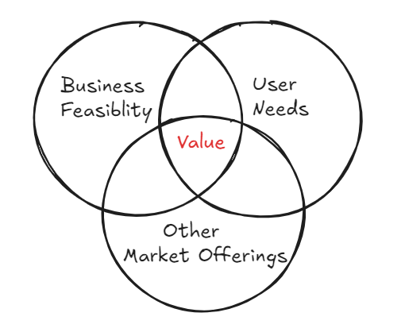
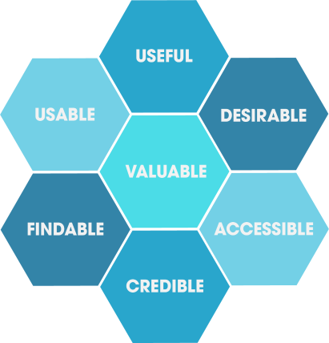

**tldr;**
There are two takeaways from this article

a) A great user experience finds the sweet spot between users needs, the business's offerings based on its objectives, and what its competitors are bringing to the market.

b) User experience design is the ability to empathize deeply, as a team, with the end user of your the product.

## UXD
When using some products or services, I often wonder what makes some of them so intuitive, seamless, and engaging. It seems as though the designers are always a step ahead as their design ensured that the information I need is easily available or discoverable. 

While various factors contribute to this, such as innovation, unique value, engaging content etc. One key element that contributes to user engagement is the user experience. But what exactly is user experience, and can products be intentionally designed to enhance this user experience ? It turns out that they can be. This activity is called User Experience Design or UXD.

So lets first understand what is user experience design. The term "user experience" has become so overused/loaded/cliche, that it now comes to mean many things it only partially represents or doesn't represent at all.

So lets dive in and understand what user experience design is & what it isnt.

## What UXD isnt
### UXD isnt just User Interface Design
A common misconception is that UXD (User Experience Design) is solely about interface design. While interface design is a component of user experience, UXD encompasses much more. It involves aspects of cognitive science, such as understanding how users perceive things and determining what kind of experience they truly need or want in order to accept a product. In layman terms this means gauging users reactions by empathizing with them and thinking from their perspective. 

UXD also includes doing research on the competition to understand the experiences they offer and how it ties down to their success or failure. 

### UXD isnt meant only for designers
As mentioned above UXD is much more than user interface design therefore its not only the job of a designer to think about user experience it is also to be practiced by project managers, product owners, developers, database designers, software architects, business analysts & everyone who's involved in taking the product from idea to market.

Lets look at how different roles contribute to UXD

**Products Owners** : Prioritize user-centered features which will help the business, and ensure the project stays aligned with user needs and business objectives. Act as a bridge between users & the creators of the product.

**Developers** : Implement user-friendly features, optimize performance, and ensure the application is responsive and accessible. They also provide feedback on the feasibility of design ideas and suggest improvements based on technical constraints.

**Database Designers** : Ensure that the data structure supports efficient and quick retrieval of information, which contributes to a seamless and responsive user experience.

**Architects** : Design scalable and maintainable systems that support a smooth user experience. They ensure that the architecture can accommodate future user needs and changes in technology.

**Marketing** : Conduct user research and gather feedback to understand user needs and preferences. This information helps shape the product to better meet user expectations.

**Customer Support** : Provide insights into common user problems and questions, which can inform improvements to the user experience. They also offer direct user feedback that can highlight areas needing attention. 

**Quality Assurance (QA)** : Ensure the product is reliable and free of issues that could frustrate users. They test user flows and interactions to ensure they are smooth and intuitive.

**Content Writers** : Write clear and concise instructions, help texts, and error messages that guide users and enhance their experience.

### UXD isnt a discrete one time activity
As seen in the previous point a whole lot of roles contribute knowingly or unknowingly to the ultimate form of the product and usually its an iterative process, whereby the product evolves based on the feedback from not just the users but also budget, time, personnel, audience expectations, and internal politics etc. all shape the final product.

In essence, many forces shape a product's form, evolving it throughout the development process.

To illustrate the continuous nature of design, consider a scenario where one of our customers decided to switch to a Single Sign-On (SSO) system for logging in. While this might seem like a straightforward change, it quickly became apparent that the switch would have broader implications. For instance, part of the system was accessible via public-facing devices such as kiosks. Implementing SSO for these devices posed security risks. As a result, we needed to design an alternative mechanism, such as time-based one-time pins (TOTP), to ensure secure access.

Since typing in a URL and then typing in the PIN would result in a poor user experience when compared to SSO as that would one of the motivations to move to SSO, we made it more seamless by implementing a QR code-based login mechanism. This allowed users to login by simply scanning a code(with totp embedded) from the kiosk device, streamlining their login experience.

So UXD shouldn't just be an item on a checklist. It must be ingrained in the mindset of everyone involved with the product. This begins with considering how their daily activities/work impact the end user of the product.

### UXD isnt just for Digital products or Technology
UXD as the name suggests is designing an experience and it evolves based on a feedback loop between the experience provided & the experiencers that is us, and in no way this ties down only to technology. Just think of it the road we drive our car on to work, the shopping mall or the adventure themed park we visit all provide their own experiences. If you look closely they have been designed a certain way to cater to you so UXD isnt only about technology. Technology could be an enabler in enhancing the experience.

### UXD isnt just about being (overly ?) functional/efficient
David mallouf, professor interaction design at Savannah college, says Usability's focus on efficiency and effectiveness sometimes excludes learnability, visceral & emotional responses.

It could make the product over engineered, overly complicated resulting in an abuse of UXD.

One prime example is of [Juicero](https://www.cnet.com/culturejuicero-is-still-the-greatest-example-of-silicon-valley-stupidity/).

**Juicero** was a high-tech juicing machine that gained notoriety for several reasons, often cited as an example of Silicon Valley's tendency to over-engineer solutions to problems that don't exist:

To quote the article from CNET

  > The company's whole aesthetic -- from its machines, to its website to its advertising --  took a leaf out of Jony Ive's Apple design book, with sleek lines, poppy colours and a lot of white. "Perfected by Earth," the Juicero billboards read. "Pressed by us." If the machine was the giant juice-squeezing **iPod**, the Produce Packs were the 99-cent **music tracks** you digested every morning. 

Some of its issues were

- **Expensive and Over-engineered**:
  - The Juicero machine cost $400 (initially $700) and required proprietary juice packs, which were expensive as well.
  - The machine was equipped with Wi-Fi connectivity and a QR code scanner to verify the freshness of the juice packs, features many found unnecessary.

- **Unnecessary Technology**:
    - A significant issue was that users discovered they could simply squeeze the juice packs by hand to get the same result, making the expensive machine redundant. This revelation led to widespread ridicule and criticism of the product and its business model.

- **Market Misfit**:
    - Juicero targeted a niche market that was not large enough to sustain its high costs.
        The value proposition did not resonate with a broader audience, leading to poor sales.

### UXD isnt just about users of the product
UXD isnt just about the users its also about satisfying those user needs that align with the business objectives. It should be a value loop between the user and the business - the business solves a user problem & provides a good experience in doing so, provided the user can repay that value so that the business is sustainable

## What UXD is
You would have already got a cue as to what it is from the above section, so to summarize some other aspects

### UXD is about the overrall experience
UXD is designing an experience which provides an overall value, and what is that ? As per the UX HoneyComb for something to valuable it should be findable, usable & accessible at a rational level it should feel useful & credible & at the level of emotion & it should be desirable.

## Why should we care about UXD

### Because we create for people
In today's world, every product, app, or service we design is intended to be used by someone. When people have bad experiences, those experiences stick with them and can leave a lasting negative impression. In an age where bad reviews can spread rapidly online, ensuring a positive user experience is crucial. A single negative review can tarnish a product's reputation, while good experiences can encourage repeat use and positive word-of-mouth. UXD ensures that users not only achieve their goals but do so with ease, satisfaction, and even enjoyment, fostering loyalty and success for the product.

### UXD ensures people use things
People use things when
- They can easily figure out how to accomplish our task
- The steps involved in doing a task no matter how complex seem simple as the sense of effort and cognitive load are minimized
- Immediate & clear feedback is provided for interactions
- Errors are undoable, that is even when they do make a mistake the system can recover easily and quickly
